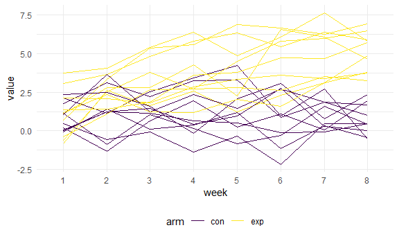

p8105_hw5_zl3119
================
Zheyan
11/11/2021

# Problem 2

Data from a longitudinal study that included a control arm and an
experimental arm. Data for each participant is included in a separate
file, and file names include the subject ID and arm.

### Create and tidy data

Create a tidy dataframe containing data from all participants, including
the subject ID, arm, and observations over time; Tidy the result;
manipulate file names to include control arm and subject ID, make sure
weekly observations are “tidy”, and do any other tidying that’s
necessary

``` r
data_path = 'data'
file_list = list.files(data_path)


extract_ID_arm = function(filename) {
    filefront = strsplit(filename, split = '.', fixed = TRUE)[[1]][1]
    # extract info about arm and ID
    arm = strsplit(filefront, split = '_', fixed = TRUE)[[1]][1]
    ID = as.integer(strsplit(filefront, split = '_', fixed = TRUE)[[1]][2])
    # read file
    df_temp = read_delim(paste(data_path, filename, sep = '/'), delim = ',')
    df_temp %>%  
         mutate(arm = arm,
         ID = ID) 
}


df = map_df(list.files(data_path), extract_ID_arm) %>% 
  arrange(arm, ID) %>% 
  relocate(arm, ID) %>% 
  pivot_longer(week_1:week_8, names_to = 'week', names_prefix = 'week_',values_to = 'value') %>% 
  mutate(week = as.factor(week))

# show data
head(df,16) %>% 
  knitr::kable()
```

| arm |  ID | week | value |
|:----|----:|:-----|------:|
| con |   1 | 1    |  0.20 |
| con |   1 | 2    | -1.31 |
| con |   1 | 3    |  0.66 |
| con |   1 | 4    |  1.96 |
| con |   1 | 5    |  0.23 |
| con |   1 | 6    |  1.09 |
| con |   1 | 7    |  0.05 |
| con |   1 | 8    |  1.94 |
| con |   2 | 1    |  1.13 |
| con |   2 | 2    | -0.88 |
| con |   2 | 3    |  1.07 |
| con |   2 | 4    |  0.17 |
| con |   2 | 5    | -0.83 |
| con |   2 | 6    | -0.31 |
| con |   2 | 7    |  1.58 |
| con |   2 | 8    |  0.44 |

### Visualization

Make a spaghetti plot showing observations on each subject over time,
and comment on differences between groups.

``` r
df %>% 
  ggplot(aes(x = week, y = value, group = paste0(ID, arm), color = arm)) +
  geom_line()
```



Two groups are similar at the first week. Paticipants in the experiment
group have increasing value while those from control group have
fluctuate values. Paticipants from experiment grouphave higher value at
last two weeks.

# Problem 3

For numeric variables, you should fill in missing values with the mean
of non-missing values For character variables, you should fill in
missing values with “virginica”

``` r
# define the impute values
impute = 
  map_df(iris_with_missing, ~mean(.x, na.rm = TRUE)) %>% 
  mutate(Species = "virginica")
```

    ## Warning in mean.default(.x, na.rm = TRUE): argument is not numeric or logical:
    ## returning NA

``` r
# copy an iris set to impute on
iris_imputed = iris_with_missing

# impute by columns 
for (col in colnames(iris_with_missing)){
  colvalues = iris_imputed[col]
  iris_imputed[col] = 
    colvalues %>% 
    replace(is.na(colvalues), impute[[col]])
}

print(paste0('Missing value counts:',sum(is.na(iris_imputed))))
```

    ## [1] "Missing value counts:0"

``` r
# show imputed dataframe
head(iris_imputed,12) %>% 
  knitr::kable()
```

| Sepal.Length | Sepal.Width | Petal.Length | Petal.Width | Species |
|-------------:|------------:|-------------:|------------:|:--------|
|     5.100000 |    3.500000 |     1.400000 |    0.200000 | setosa  |
|     4.900000 |    3.000000 |     1.400000 |    0.200000 | setosa  |
|     4.700000 |    3.200000 |     1.300000 |    0.200000 | setosa  |
|     4.600000 |    3.100000 |     1.500000 |    1.192308 | setosa  |
|     5.000000 |    3.600000 |     1.400000 |    0.200000 | setosa  |
|     5.400000 |    3.900000 |     1.700000 |    0.400000 | setosa  |
|     5.819231 |    3.400000 |     1.400000 |    0.300000 | setosa  |
|     5.000000 |    3.400000 |     1.500000 |    0.200000 | setosa  |
|     4.400000 |    2.900000 |     1.400000 |    0.200000 | setosa  |
|     4.900000 |    3.100000 |     3.765385 |    0.100000 | setosa  |
|     5.400000 |    3.075385 |     1.500000 |    0.200000 | setosa  |
|     4.800000 |    3.400000 |     1.600000 |    0.200000 | setosa  |
