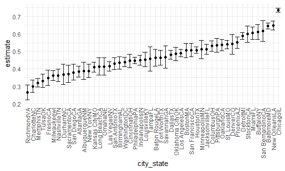
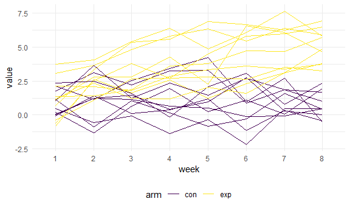

p8105_hw5_zl3119
================
Zheyan
11/11/2021

# Problem 1

The Washington Post has gathered data on homicides in 50 large U.S.
cities and made the data available through a GitHub repository Describe
the raw data. Create a city_state variable (e.g. “Baltimore, MD”) and
then summarize within cities to obtain the total number of homicides and
the number of unsolved homicides (those for which the disposition is
“Closed without arrest” or “Open/No arrest”).

``` r
homicide_df = 
  read_csv('homicide-data.csv', show_col_types = FALSE, na = c("", 'Unknown')) %>% 
  mutate(city_state = str_c(city, state),
         resolution = case_when(
           disposition == 'Closed without arrest' ~ 'unsolved',
           disposition == 'Open/No arrest' ~ 'unsolved',
           disposition == 'Closed by arrest' ~ 'solved'
         )) %>% 
  relocate(city_state)
```

For the city of Baltimore, MD, use the prop.test function to estimate
the proportion of homicides that are unsolved; save the output of
prop.test as an R object, apply the broom::tidy to this object and pull
the estimated proportion and confidence intervals from the resulting
tidy dataframe.

``` r
baltimore_df = 
  homicide_df %>% 
  filter(city_state == 'BaltimoreMD')

baltimore_summary = 
  baltimore_df %>% 
    summarise(
      unsolved = sum(resolution == 'unsolved'),
      n = n()
    )

baltimore_test = 
  prop.test(
    x = baltimore_summary %>% pull(unsolved),
    n = baltimore_summary %>% pull(n)
  )

baltimore_test %>% 
  broom::tidy() %>% 
  knitr::kable()
```

|  estimate | statistic | p.value | parameter |  conf.low | conf.high | method                                               | alternative |
|----------:|----------:|--------:|----------:|----------:|----------:|:-----------------------------------------------------|:------------|
| 0.6455607 |   239.011 |       0 |         1 | 0.6275625 | 0.6631599 | 1-sample proportions test with continuity correction | two.sided   |

Now run prop.test for each of the cities in your dataset, and extract
both the proportion of unsolved homicides and the confidence interval
for each. Do this within a “tidy” pipeline, making use of purrr::map,
purrr::map2, list columns and unnest as necessary to create a tidy
dataframe with estimated proportions and CIs for each city.

``` r
prop_test_function = function(city_df){
  
  city_summary = 
    city_df %>% 
      summarise(
        unsolved = sum(resolution == 'unsolved'),
        n = n()
      )
  
  city_test = 
    prop.test(
      x = city_summary %>% pull(unsolved),
      n = city_summary %>% pull(n)
    )
  
  city_test
}


# prop_test_function(baltimore_df)

# check another city
homicide_df %>% 
  filter(city_state == 'AlbuquerqueNM') %>% 
  prop_test_function() %>% 
  broom::tidy() %>% 
  knitr::kable()
```

|  estimate | statistic |  p.value | parameter |  conf.low | conf.high | method                                               | alternative |
|----------:|----------:|---------:|----------:|----------:|----------:|:-----------------------------------------------------|:------------|
| 0.3862434 |  19.11376 | 1.23e-05 |         1 | 0.3372604 | 0.4375766 | 1-sample proportions test with continuity correction | two.sided   |

Iterate across all cities

``` r
results_df = 
  homicide_df %>% 
    nest(-city_state) %>% 
    mutate(
      test_results = map(data, prop_test_function),
      tidy_results = map(test_results, broom::tidy)
    ) %>% 
    select(city_state, tidy_results) %>% 
    unnest(tidy_results) %>% 
    select(city_state, estimate, starts_with('conf'))

head(results_df) %>% 
  knitr::kable()
```

| city_state    |  estimate |  conf.low | conf.high |
|:--------------|----------:|----------:|----------:|
| AlbuquerqueNM | 0.3862434 | 0.3372604 | 0.4375766 |
| AtlantaGA     | 0.3833505 | 0.3528119 | 0.4148219 |
| BaltimoreMD   | 0.6455607 | 0.6275625 | 0.6631599 |
| Baton RougeLA | 0.4622642 | 0.4141987 | 0.5110240 |
| BirminghamAL  | 0.4337500 | 0.3991889 | 0.4689557 |
| BostonMA      | 0.5048860 | 0.4646219 | 0.5450881 |

Create a plot that shows the estimates and CIs for each city – check out
geom_errorbar for a way to add error bars based on the upper and lower
limits. Organize cities according to the proportion of unsolved
homicides.

``` r
results_df %>% 
  filter(city_state != 'TulsaAL') %>% 
  mutate(city_state = fct_reorder(city_state, estimate)) %>% 
  ggplot(aes(x = city_state, y = estimate)) +
  geom_point() +
  geom_errorbar(aes(ymin = conf.low, ymax = conf.high)) +  
  theme(axis.text.x = element_text(angle = 90, vjust = 0.5, hjust=1))
```



# Problem 2

Data from a longitudinal study that included a control arm and an
experimental arm. Data for each participant is included in a separate
file, and file names include the subject ID and arm.

### Create and tidy data

Create a tidy dataframe containing data from all participants, including
the subject ID, arm, and observations over time; Tidy the result;
manipulate file names to include control arm and subject ID, make sure
weekly observations are “tidy”, and do any other tidying that’s
necessary

``` r
data_path = 'data'
file_list = list.files(data_path)


extract_ID_arm = function(filename) {
    filefront = strsplit(filename, split = '.', fixed = TRUE)[[1]][1]
    # extract info about arm and ID
    arm = strsplit(filefront, split = '_', fixed = TRUE)[[1]][1]
    ID = as.integer(strsplit(filefront, split = '_', fixed = TRUE)[[1]][2])
    # read file
    df_temp = read_delim(paste(data_path, filename, sep = '/'), delim = ',')
    df_temp %>%  
         mutate(arm = arm,
         ID = ID) 
}


df = map_df(list.files(data_path), extract_ID_arm) %>% 
  arrange(arm, ID) %>% 
  relocate(arm, ID) %>% 
  pivot_longer(week_1:week_8, names_to = 'week', names_prefix = 'week_',values_to = 'value') %>% 
  mutate(week = as.factor(week))

# show data
head(df,16) %>% 
  knitr::kable()
```

| arm |  ID | week | value |
|:----|----:|:-----|------:|
| con |   1 | 1    |  0.20 |
| con |   1 | 2    | -1.31 |
| con |   1 | 3    |  0.66 |
| con |   1 | 4    |  1.96 |
| con |   1 | 5    |  0.23 |
| con |   1 | 6    |  1.09 |
| con |   1 | 7    |  0.05 |
| con |   1 | 8    |  1.94 |
| con |   2 | 1    |  1.13 |
| con |   2 | 2    | -0.88 |
| con |   2 | 3    |  1.07 |
| con |   2 | 4    |  0.17 |
| con |   2 | 5    | -0.83 |
| con |   2 | 6    | -0.31 |
| con |   2 | 7    |  1.58 |
| con |   2 | 8    |  0.44 |

### Visualization

Make a spaghetti plot showing observations on each subject over time,
and comment on differences between groups.

``` r
df %>% 
  ggplot(aes(x = week, y = value, group = paste0(ID, arm), color = arm)) +
  geom_line()
```



Two groups are similar at the first week. Paticipants in the experiment
group have increasing value while those from control group have
fluctuate values. Paticipants from experiment grouphave higher value at
last two weeks.

# Problem 3

For numeric variables, fill in missing values with the mean of
non-missing values For character variables, fill in missing values with
“virginica”

``` r
# impute function
impute_func = function(df, col) {
  colvalues = df %>% pull(col)
  if (class(colvalues) == 'numeric') {
    imputed = mean(colvalues, na.rm = TRUE)
    colvalues = colvalues %>% replace_na(imputed)
  } 
  else if (class(colvalues) == 'character') {
    colvalues = colvalues %>% replace_na('virginica')
  }
  colvalues
}

# copy an iris set to impute on
iris_imputed = iris_with_missing
# impute
for (col in colnames(iris_with_missing)) {
  iris_imputed[col] = impute_func(iris_imputed, col)
}

# check if still has na
print(paste0('Missing value counts:',sum(is.na(iris_imputed))))
```

    ## [1] "Missing value counts:0"

``` r
# show imputed dataframe
head(iris_imputed,12) %>% 
  knitr::kable()
```

| Sepal.Length | Sepal.Width | Petal.Length | Petal.Width | Species |
|-------------:|------------:|-------------:|------------:|:--------|
|     5.100000 |    3.500000 |     1.400000 |    0.200000 | setosa  |
|     4.900000 |    3.000000 |     1.400000 |    0.200000 | setosa  |
|     4.700000 |    3.200000 |     1.300000 |    0.200000 | setosa  |
|     4.600000 |    3.100000 |     1.500000 |    1.192308 | setosa  |
|     5.000000 |    3.600000 |     1.400000 |    0.200000 | setosa  |
|     5.400000 |    3.900000 |     1.700000 |    0.400000 | setosa  |
|     5.819231 |    3.400000 |     1.400000 |    0.300000 | setosa  |
|     5.000000 |    3.400000 |     1.500000 |    0.200000 | setosa  |
|     4.400000 |    2.900000 |     1.400000 |    0.200000 | setosa  |
|     4.900000 |    3.100000 |     3.765385 |    0.100000 | setosa  |
|     5.400000 |    3.075385 |     1.500000 |    0.200000 | setosa  |
|     4.800000 |    3.400000 |     1.600000 |    0.200000 | setosa  |
